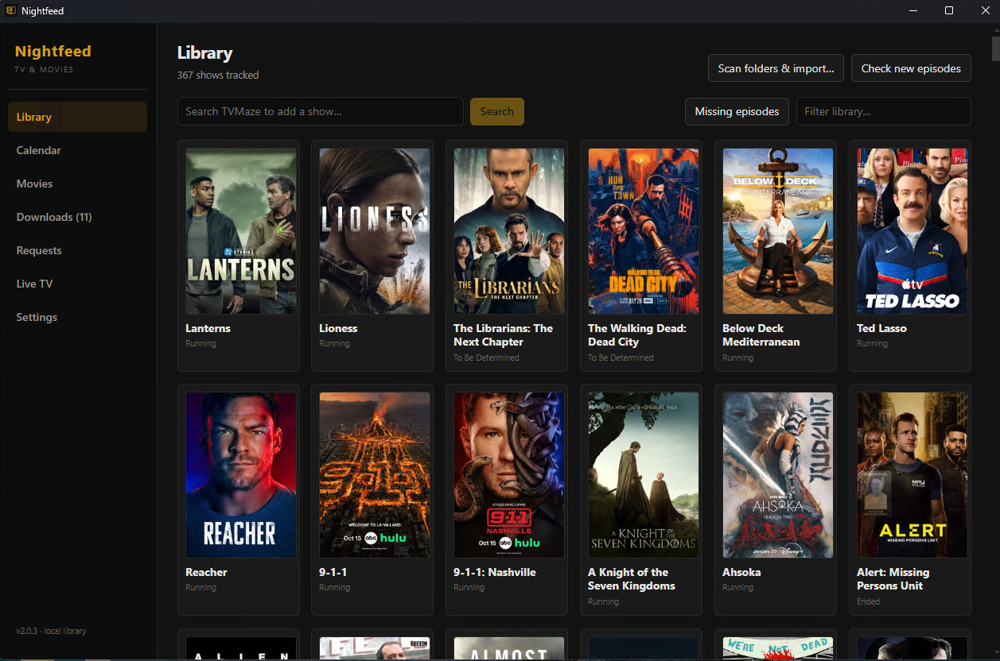
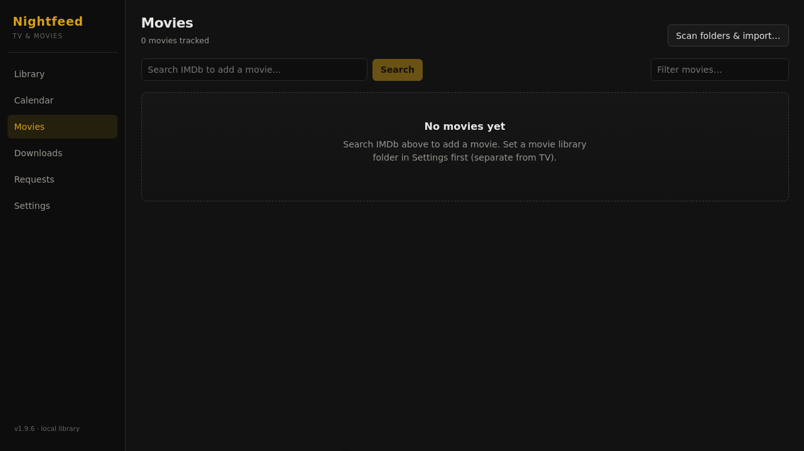
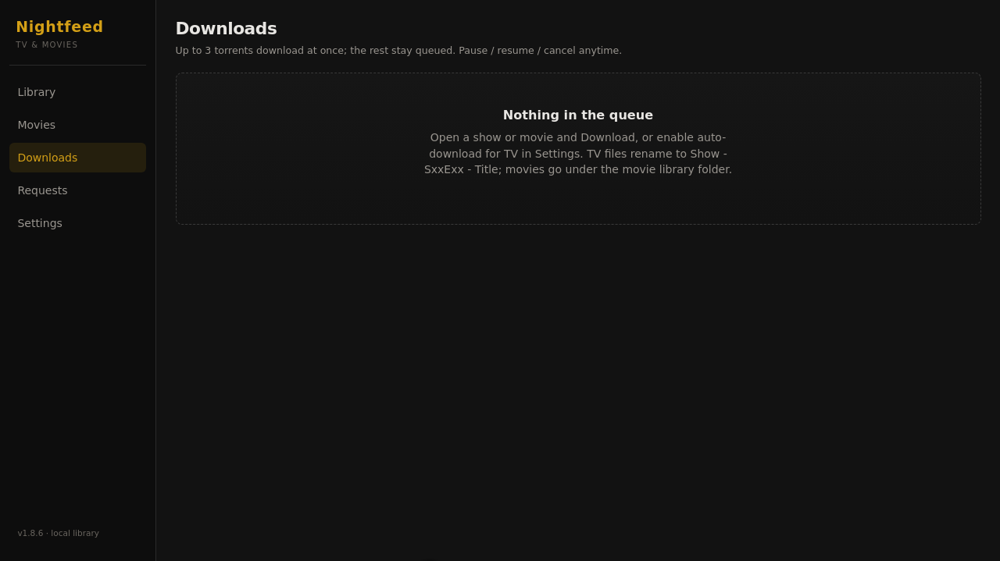
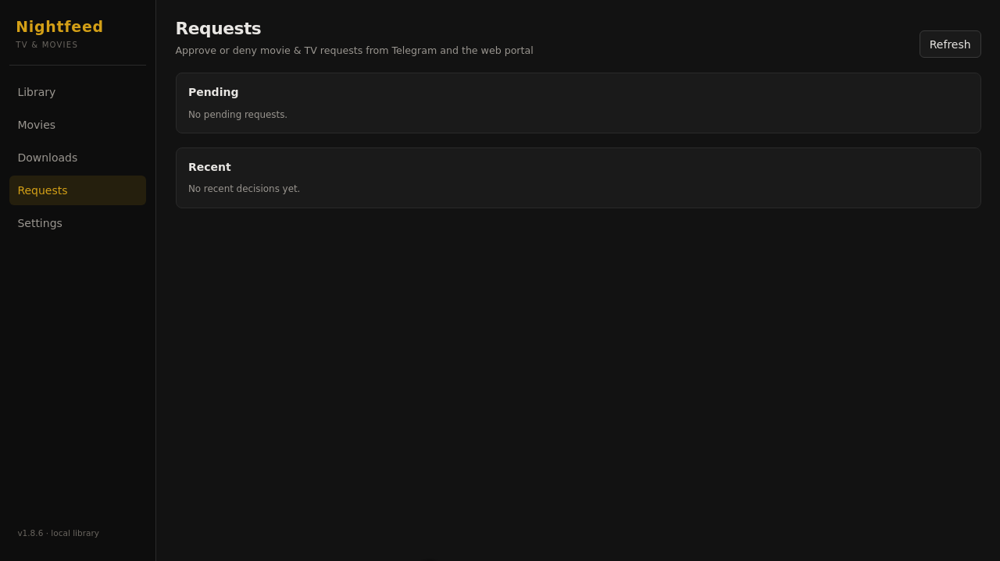
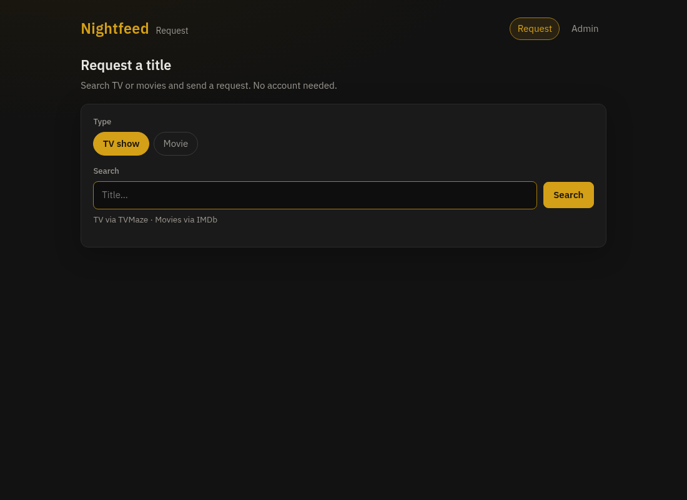
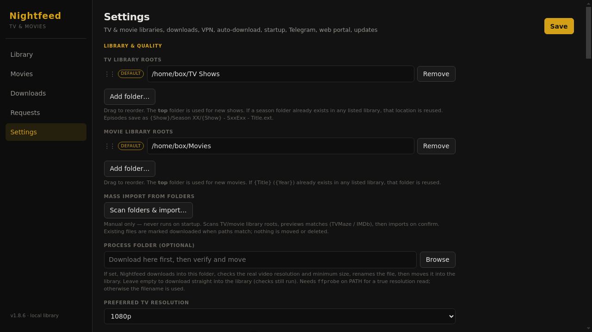

# Nightfeed Features

Dark chrome, gold accents — a desktop TV & movie manager with embedded torrents, requests, VPN split tunnel, and a local web portal.

**v1.8.7** · Electron · React · WebTorrent · TVMaze · IMDb

[← Back to README](README.md)

---

## At a glance

| Area | What you get |
|------|----------------|
| **Library** | Track shows via TVMaze (no API key), missing-episodes filter, season bulk status, folder scan import |
| **Calendar** | Week view of episode air dates; click through to the show |
| **Movies** | Separate movie library, IMDb metadata scrape (no API key) |
| **Downloads** | Embedded WebTorrent (`utilityProcess`), queue of 3 active, pause/resume/cancel |
| **Requests** | In-app approve/deny + Telegram + web portal |
| **Settings** | Multi-root libraries, UNC, FTP, OpenVPN split tunnel/kill switch, backup, updater |

---

## Library (TV)

- Search & track shows through [TVMaze](https://www.tvmaze.com/) — **no API key**
- Filter the grid to **shows with missing episodes**
- Fast library list with **season bulk status**

---

## Calendar

- Monday–Sunday week of **episode air dates** from your tracked shows
- Previous / This week / Next
- Each day lists show, `SxxExx`, episode title, and status
- Click an episode to open that show
- **Check new episodes** on demand or on a schedule
- **Scan folders & import…** — preview matches, confirm; never auto-imports on startup
- Episode files rename to `Show - SxxExx - Title`
- Poster cache on disk for snappy browsing

---

## Movies

- Separate movie library roots from TV
- Metadata via **IMDb.com** scrape — **no TMDB/IMDb API key**
- Search, filter, and track download status per title
- Naming: `{Title} ({Year})`
- Movies tab is cached so revisiting doesn’t rescan every folder

---

## Downloads

- **WebTorrent** embedded — prefers Electron `utilityProcess` so hashing/peers stay off the UI thread
- Up to **3 torrents** active; the rest stay queued
- Pause / resume / cancel anytime
- **Multi-source search** on `worker_threads`: Apibay, Knaben, YourBittorrent, Torrents.csv, EZTV, AnimeTosho, Nyaa, LimeTorrents (+ optional Jackett)
- Library/show search (TVMaze / IMDb) also runs on its own worker so typing stays responsive during downloads
- Rank by preferred resolution, then seeders; skip junk (CAM/TS) and low-seed results
- Optional **process folder**: download → `ffprobe` resolution & min size → rename → move into the library
- Preferred + minimum resolution (720p / 1080p / 2160p) and per-resolution minimum file size
- Reject non-video / `.exe` payloads
- Optional **FTP upload** when a download finishes

---

## Requests (in-app)

- Pending and recent queues with posters
- Approve or deny requests from **Telegram** and the **web portal**
- Badge on the nav when something is waiting

---

## Web portal

- Local HTTP request page — TV or movie, no account needed
- Admin login to approve/deny (password set in Settings)
- Optional **LAN bind** so phones/PCs on your network can request titles
- Larger posters, type pills, stats, auto-refresh admin UI

---

## Settings & libraries

- **Multiple TV and movie library roots** — drag to reorder; top is default for new titles; existing season/movie folders are reused
- **UNC paths** supported for Windows network shares
- Process folder, preferred/minimum resolution, min size per quality
- WebTorrent connection & speed caps
- **Backup** — export/import settings + TV + movie libraries (JSON; includes secrets — keep private)
- Launch on Windows startup
- GitHub PAT for private-repo **in-app updates** (check on startup + every 6h; progress, Retry, Install)

---

## OpenVPN — torrent-only split tunnel

- Nightfeed starts Community **`openvpn.exe`** (CLI session, not the OpenVPN GUI)
- Import `.ovpn` (copies relative ca/cert/key sidecars)
- Auto-connect on launch when enabled
- **Split tunnel**: torrent sockets bind to the TAP **host** IP and force the TAP adapter (`IP_UNICAST_IF` on Windows); Plex, browser, and port-forward keep your ISP IP
- **Kill switch** when “Require VPN for torrents” is on — torrents pause until OpenVPN is connected
- Admin Telegram alert + in-app banner on drop / failed connect; one reconnect attempt

---

## Telegram bot

- **Admin** chats: full control + approve/deny, VPN alerts, optional daily download briefing
- **Requests** chats: `/request-show` / `/request-movie` only
- Extra admin commands: `/search`, `/add-movie`, `/vpn`, `/pause`, `/resume`, `/missing`
- Posters on requests, add, approve/deny, and download finished
- Unknown chats only get `Your chat ID: …`

---

## Auto-download & quality

- Schedule missing episodes; skip ignored
- Prefer configured resolution with enough seeders; never keep a file below the minimum
- TV results filtered to the matching `SxxExx` (not season packs)
- Get / **Get other** for already-downloaded episodes or movies

---

## Performance & reliability

- `utilityProcess` for WebTorrent when available; `worker_threads` for torrent index merge/rank and metadata search
- Progress IPC throttled; download store writes debounced so Library doesn’t thrash
- Cap concurrent peers; disable uTP on Windows to avoid `ENOBUFS`
- Pause torrents (and VPN) before Restart to install an update

---

## More

Full release notes: [CHANGELOG.md](CHANGELOG.md) · Installers: [Releases](https://github.com/remie1529/Nightfeed/releases)
